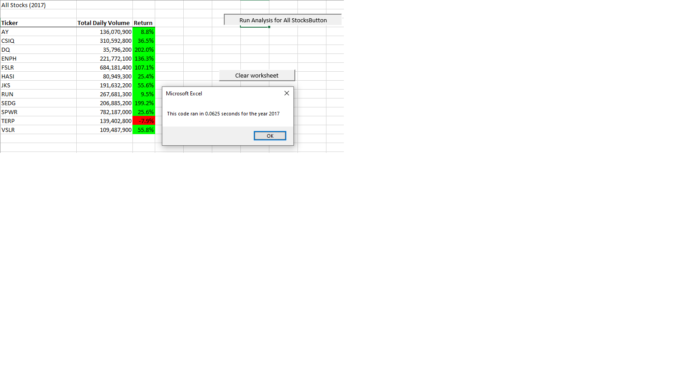

# Stock Analysis Project

## Overview of Project- Analyse Large amount of stock market data with a diverse set of desired results based on requirements.

### Purpose- This Project is to use data analysis on a stock market data to determine the performace of a desired stock compared to other "green" stocks. 

### Analysis (thought process) and Challenges
 1. using a single "for loop" dramatically reduced the processing time for the script
--
 1. My biggest challenge was getting the format of my script legible and propperly notated so I could track what I was doing.
 2. Scratching the surface and getting my mindset focused on variables and ranges was tough.

### Screenshots of elapsed time by year
#### Here is the link to the 2017 time

#### Here is the link to the 2018 time

### Challenges and Difficulties Encountered
#### One of the things I have learned is that one single "'" will tank your script. It is very important to be meticulous with both syntax and with annotation inside the code to be able to separate logical functions, especially if you have errors.

## The results!

- first conclusion
--- the stock "DQ" did well in 2017 but had a rough 2018.  The stock "ENPH" performed much better overall in both years.

- second conclusion
--- the refactored code ran at least twice as fast as the original, due to essencially less than half the actual work to come up with the same results in a more efficient manner.

- 
